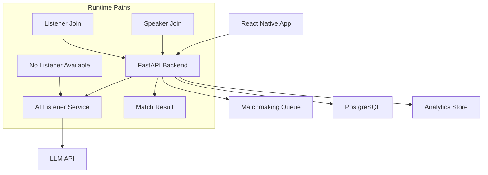

# Anonymous Voice-Based Emotional Support Platform with AI Listener Fallback

## One-Page Capstone Proposal

### Problem
Many people need immediate emotional support but cannot access private, affordable, and always-available options. Existing channels often require identity disclosure, have delays, or are expensive.

### Proposed Solution
Build a mobile-first platform that allows users to anonymously join as a speaker or listener for voice-based support sessions. If no human listener is available, an AI listener is provided as fallback to maintain continuous access.

### Research Question
Can anonymous voice-based active listening with AI fallback improve access to emotional support compared to text-based anonymous support systems?

### Objectives
1. Enable anonymous speaker-listener voice sessions.
2. Match speakers to available listeners in near real time.
3. Provide AI fallback when no listener is online.
4. Record anonymized session metrics for operational insight.
5. Support safety with a basic reporting flow.

### Scope (Version 1)
Included:
- Anonymous session entry.
- Speaker/listener matchmaking.
- Voice session setup signaling.
- AI listener fallback endpoint.
- Session health and minimal analytics events.

Excluded:
- Video calls.
- Identity-based profiles and social features.
- Payments and therapy claims.
- Public forums and direct messaging.
- Advanced personalized mental-health analytics.

### System Architecture

### Technical Stack
- Frontend: React Native.
- Backend: FastAPI.
- Data: PostgreSQL.
- Real-time: WebSockets/WebRTC signaling.
- AI: Speech-to-Text, LLM response generation, Text-to-Speech.
- Deployment: Vercel for backend API (current stage), mobile app distributed separately.

### Deliverables
1. Mobile app prototype.
2. Backend API service.
3. Matchmaking engine.
4. AI listener fallback module.
5. Admin analytics baseline.
6. Deployment and technical documentation.

### Evaluation Plan
Measure:
- Match success rate.
- Time-to-first-response.
- AI fallback utilization rate.
- Session duration distribution.
- User safety report frequency.

Success Criteria:
- Most speaker requests receive a listener or AI fallback within a short target time window.
- The platform remains anonymous and operationally stable under expected capstone usage.
